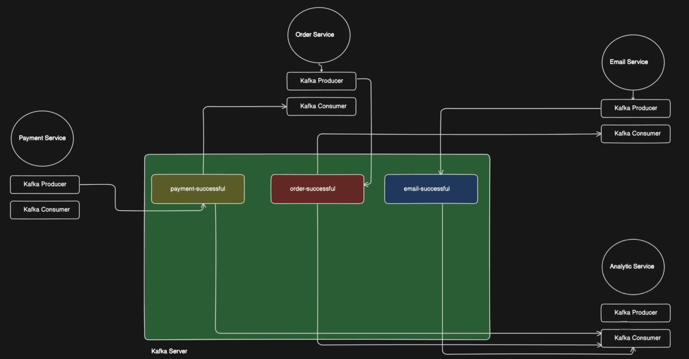

# E-commerce Microservices with Kafka

A modern e-commerce application built using microservices architecture with Apache Kafka for event-driven communication between services.

## 🚀 Project Overview

This project demonstrates the implementation of a distributed e-commerce system using microservices pattern. The application simulates an online shopping cart with payment processing, order management, email notifications, and analytics - all connected through Apache Kafka message streaming.

## 🛠️ Technologies Used

### Frontend
- **Next.js 15.3.3** - React framework for production
- **React 19** - JavaScript library for building user interfaces
- **TailwindCSS 4** - Utility-first CSS framework
- **React Query (TanStack Query)** - Data fetching and state management
- **Axios** - HTTP client for API requests
- **Lucide React** - Modern icon library

### Backend Services
- **Node.js** - JavaScript runtime for backend services
- **Express.js** - Web application framework
- **KafkaJS** - Apache Kafka client for Node.js
- **CORS** - Cross-origin resource sharing middleware

### Infrastructure
- **Apache Kafka** - Distributed event streaming platform
- **Docker & Docker Compose** - Containerization and orchestration
- **KRaft Mode** - Kafka without Zookeeper dependency

## 🏗️ Architecture

The application follows a microservices architecture with the following services:



### Event Flow
1. **User Action**: Customer clicks checkout on the frontend
2. **Payment Processing**: Payment service processes the transaction and publishes "payment-successful" event to Kafka
3. **Order Creation**: Order service consumes "payment-successful" event from Kafka and creates an order, then publishes "order-successful" event
4. **Email Notification**: Email service consumes "order-successful" event from Kafka and sends confirmation email, then publishes "email-successful" event
5. **Analytics**: Analytics service consumes all events ("payment-successful", "order-successful", "email-successful") from Kafka and tracks transaction data

**Note**: Only the Payment Service exposes an HTTP endpoint (port 8000). All other services communicate exclusively through Kafka events.

## 📦 Project Structure

```
ecommerce/
├── services/
│   ├── README.md               # This file - Project documentation
│   ├── client/                 # Next.js Frontend Application
│   │   ├── src/
│   │   │   ├── app/
│   │   │   │   ├── layout.jsx  # Root layout with navigation
│   │   │   │   ├── page.jsx    # Shopping cart page
│   │   │   │   └── globals.css # Global styles
│   │   │   └── components/
│   │   │       └── Pay.jsx     # Payment component
│   │   ├── public/             # Static assets
│   │   └── package.json        # Frontend dependencies
│   ├── payment-service/        # Payment processing service
│   ├── order-service/          # Order management service
│   ├── email-service/          # Email notification service
│   ├── analytic-service/       # Analytics and logging service
│   └── kafka/                  # Kafka configuration and setup
│       ├── docker-compose.yml  # Kafka cluster setup
│       └── admin.js            # Kafka topic creation
└── .git/                       # Git repository
```
```

## 🎯 What You'll Learn

- **Microservices Architecture**: Design and implement distributed systems
- **Event-Driven Programming**: Use Apache Kafka for service communication
- **Asynchronous Processing**: Handle non-blocking operations between services
- **Container Orchestration**: Deploy services using Docker Compose
- **Modern Frontend Development**: Build responsive UIs with Next.js and TailwindCSS
- **API Integration**: Connect frontend with multiple backend services
- **Message Streaming**: Implement pub/sub patterns with Kafka
- **Service Independence**: Create loosely coupled, independently deployable services

## 📋 Dependencies

### Frontend (Client)
```json
{
  "dependencies": {
    "@tanstack/react-query": "^5.80.7",
    "axios": "^1.9.0",
    "lucide-react": "^0.514.0",
    "next": "15.3.3",
    "react": "^19.0.0",
    "react-dom": "^19.0.0"
  },
  "devDependencies": {
    "@eslint/eslintrc": "^3",
    "@tailwindcss/postcss": "^4",
    "eslint": "^9",
    "eslint-config-next": "15.3.3",
    "tailwindcss": "^4"
  }
}
```

### Backend Services
```json
{
  "dependencies": {
    "express": "^5.1.0",
    "cors": "^2.8.5",
    "kafkajs": "^2.2.4"
  }
}
```

## 🚀 How to Reproduce This Project

### Prerequisites
- **Node.js** (v18 or higher)
- **Docker & Docker Compose**
- **Git**

### Step 1: Clone the Repository
```bash
git clone <your-repository-url>
cd ecommerce
```

### Step 2: Set Up Kafka Infrastructure
```bash
cd services/kafka
docker-compose up -d
```

Wait for Kafka cluster to be fully running, then create topics:
```bash
npm install
node admin.js
```

### Step 3: Install and Start Backend Services

**Payment Service:**
```bash
cd ../payment-service
npm install
node index.js
```

**Order Service:**
```bash
cd ../order-service
npm install
node index.js
```

**Email Service:**
```bash
cd ../email-service
npm install
node index.js
```

**Analytics Service:**
```bash
cd ../analytic-service
npm install
node index.js
```

### Step 4: Set Up Frontend
```bash
cd ../client
npm install
npm run dev
```

### Step 5: Access the Application
- **Frontend**: http://localhost:3000
- **Payment Service API**: http://localhost:8000

**Note**: Order, Email, and Analytics services are event-driven and don't expose HTTP endpoints. They communicate only through Kafka.

## 🔧 Configuration

### Kafka Brokers
- **Broker 1**: localhost:9094
- **Broker 2**: localhost:9095
- **Broker 3**: localhost:9096

